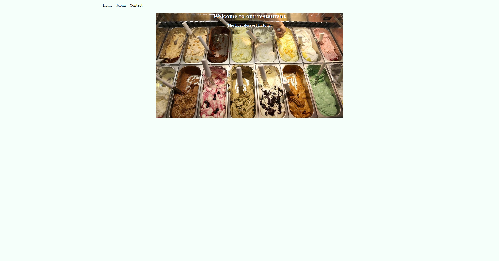

# Restaurant-page
 
   A simple restaurant page as a proof of concept
 

 
## Built With
 
   Javascript,  
   Html,  
   Css,  
   Eslint
 
## Getting Started
To get a local copy up and running follow these simple example steps.

Clone the repo  
Open the html file in a browser  

## How to Use
Click the tab you would like to navigate to  
Find a meal in our menu, or contact us with questions or concerns  

👤 **BenjaminGarza**

 Github: [@BenjaminGarza](https://github.com/BenjaminGarza)
 Twitter: [@zeroBasedIndex](https://twitter.com/zeroBasedIndex)
 Linkedin: [@Ben Garza](https://www.linkedin.com/in/benjamin-garza/)
 
 
Contributions, issues and feature requests are welcome!
 
Feel free to check the issues page.
Show your support
 
Give a star if you like this project!

## Acknowledgments
 
  The Odin Project
 
 ## License
This project is MIT licensed.

